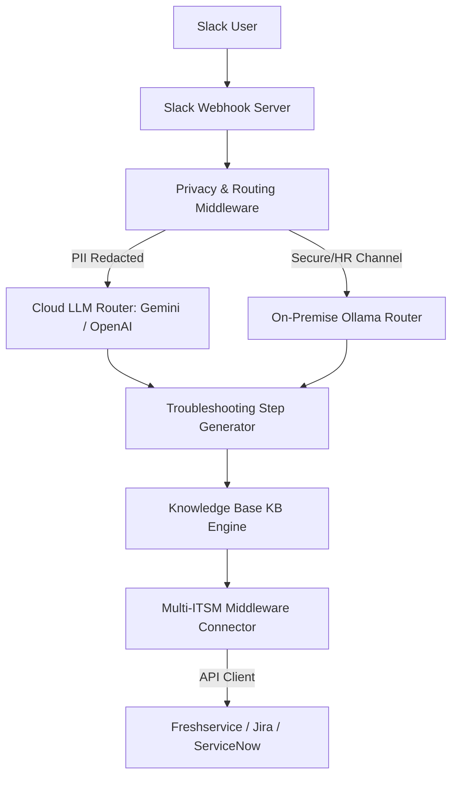

# Smart IT Helpdesk Portal
### The B2B Enterprise-Grade Slack IT Helpdesk Platform

Automate IT support, deflect routine tickets, and guarantee data compliance with our hybrid-intelligent employee concierge. Powered by state-of-the-art LLMs (Gemini, OpenAI) and local, privacy-safe models (Ollama).

---

## 📈 Executive Summary & Business Value

Traditional IT helpdesks are overwhelmed by repetitive queries like password resets, network problems, and hardware troubleshooting. This leads to slow resolution times, low employee productivity, and high operational costs.

**Smart IT Helpdesk Portal** resolves up to **45% of IT issues instantly** inside Slack using guided troubleshooting, and automatically collects data to raise structured tickets when human intervention is needed.

### Key Value Metrics
*   **45%+ Deflection Rate**: Instantly resolves common issues before a ticket is created.
*   **< 2 Seconds Response Time**: Immediate assistance for employees 24/7.
*   **70% Reduction in Ticket Quality Issues**: Enforces required parameters (Employee ID, device type, environment details) before escalating to IT agents.
*   **100% GDPR/HIPAA Compliant**: Zero data leak via dynamic PII masking and local AI model support.

---

## 📦 Tiered Packaging & Pricing Model

Choose the tier that aligns with your company's scale, security posture, and IT service management (ITSM) infrastructure.

| Feature / Benefit | Starter (SaaS) | Professional (Growth) | Enterprise (Zero-Trust) |
| :--- | :---: | :---: | :---: |
| **Pricing** | **$499 / month** | **$1,299 / month** | **Custom Enterprise Quotes** |
| **Deployment** | Multi-Tenant Cloud | Dedicated Cloud | On-Premise / VPC |
| **Slack Integration** | ✅ Yes | ✅ Yes | ✅ Yes |
| **Knowledge Base Sync** | File-based (JSON) | Live API Sync | Live API Sync + DB |
| **ITSM Connectors** | Freshservice | Freshservice, Jira, Zendesk | ServiceNow, Jira, custom API |
| **Admin Portal** | ❌ (Config files) | ✅ Interactive Web Portal | ✅ High-Security Web Portal |
| **AI Routing Engine** | Cloud Only (Gemini) | Cloud Only (Gemini/OpenAI) | Hybrid (Cloud + Local Ollama) |
| **GDPR/HIPAA Compliance** | ❌ Basic | ✅ PII Masking | ✅ Zero-Data-Leak Local Lock |
| **Support SLA** | Next Business Day | 4-Hour Response | 24/7/365 Dedicated Manager |

---

## 🛡️ Enterprise-Grade Compliance & Privacy

Security is at the heart of our platform. We offer **Hybrid Local Privacy Mode** to meet the highest regulatory standards:

### 1. PII Redaction Engine
Our zero-trust middleware automatically scans every user query inside Slack. Before transmitting data to cloud LLMs (Google Gemini or OpenAI), it redacts sensitive personal data:
*   **Emails**: `user@company.com` ➔ `[EMAIL_REDACTED]`
*   **Phone Numbers**: `+1-555-0199` ➔ `[PHONE_REDACTED]`
*   **IP Addresses**: `192.168.1.10` ➔ `[IP_REDACTED]`

### 2. On-Premise Ollama Integration
For ultra-secure channels (e.g. HR, Finance, Executive Board), the bot routes all interactions to a **locally hosted model (e.g. Llama-3-8B)** running on your secure virtual private cloud (VPC). No logs or chats ever leave your corporate firewalls.

---

## ⚙️ Technical Architecture Overview

The platform uses a plug-and-play middleware design, ensuring it integrates with your existing tech stack without complex migrations.

### Modular Components
1.  **Slack Gateway (Bolt.js)**: Handles real-time events, interactive buttons, modal forms, and notification messages.
2.  **Privacy Router**: Inspects channel origins and redacts text before invoking AI engines.
3.  **ITSM Middleware Connector**: A unified adapter interface. Whether you use Freshservice, Jira Service Management, ServiceNow, or Zendesk, the ticketing payload is normalized automatically.
4.  **Admin Web Console**: Built with responsive vanilla styling, serving clean REST API endpoints for metrics aggregation, Knowledge Base article drafting, and failover model priority settings.

---

## 🚀 Contact & Onboarding Plan

Getting started is simple. Our team handles the end-to-end integration in under 48 hours:
1.  **Sandbox Setup**: Connect our app to your Slack Developer portal.
2.  **KB Ingestion**: Automatically import your existing PDF/Markdown guides.
3.  **ITSM Connection**: Paste your ticketing API keys in the secured config panel.
4.  **Go-Live**: Deploy to your workspace and start deflecting tickets instantly.

*Interested in a live demo or a 14-day free trial? Contact sales at **sales@helpdeskportal.com**.*
